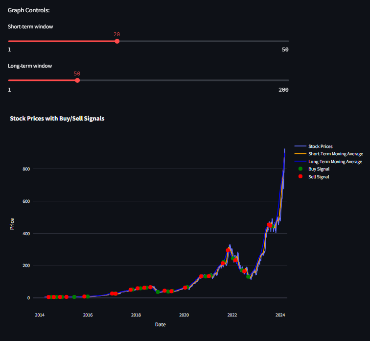

# NewsWaveMetrics 📊📰
---

 A powerful tool for analyzing news sentiment on both national and local stories, allowing users to correlate these stories with their own uploaded metrics, starting with stock market price data. Stay ahead of the curve and make informed decisions with SentimentSync.

 ## Features 🌟

 ### Stock Data Collection 📈
An automated procedure is implemented to fetch daily stock data for a specified ticker, storing the information in a database over the last 10 years. The system also includes visualization capabilities to display the stock data with corresponding buy/sell signals.

