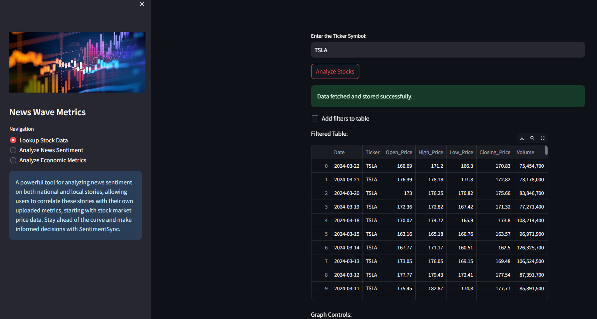

# NewsWaveMetrics 📊📰
---

 A powerful tool for analyzing news sentiment on both national and local stories, allowing users to correlate these stories with their own uploaded metrics, starting with stock market price data. Stay ahead of the curve and make informed decisions with SentimentSync.

 ## Features 🌟

 ### Stock Data Collection 📈
An automated procedure is implemented to fetch daily stock data for a specified ticker, storing the information in a database over the last 10 years. The system also includes visualization capabilities to display the stock data with corresponding buy/sell signals.




 ### News Data Analysis 📰
An automated procedure is implemented to retrieve daily news data on a designated topic, storing it in a database spanning the past decade along with sentiment analysis. Additionally, the system incorporates visualization features to depict the percentage of sentiments per year and the average sentiment value per date.


 ### Economic Data Analysis 📉
 An automated procedure has been implemented to retrieve daily or monthly data on the following metrics: exchange rates, treasury yields, fed funds rate, consumer price index, GDP, industrial production, unemployment rate, consumer sentiment, and producer price index. This data is stored in a database spanning the past decade. Additionally, the system incorporates visualization of the metrics data.


### Command Line Tools

**Command**

```bash
python fetch_yfinance.py --help
```

***Output***

```bash

uusage: fetch_yfinance.py [-h] [--data_type {info,history,actions,financials,holders,recommendations}] ticker

Fetch stock data from Yahoo Finance.

positional arguments:
  ticker                Stock ticker symbol.

options:
  -h, --help            show this help message and exit
  --data_type {info,history,actions,financials,holders,recommendations}
                        Type of data to fetch.
```


**Command**

```bash
python fetch_yfinance.py "AAPL" --data_type recommendations
```

***Output***

```bash
{
    "recommendations_summary": [
        {
            "period": "0m",
            "strongBuy": 11,
            "buy": 21,
            "hold": 6,
            "sell": 0,
            "strongSell": 0
        },
        {
            "period": "-1m",
            "strongBuy": 10,
            "buy": 17,
            "hold": 12,
            "sell": 2,
            "strongSell": 0
        },
        {
            "period": "-2m",
            "strongBuy": 10,
            "buy": 17,
            "hold": 12,
            "sell": 2,
            "strongSell": 0
        },
        {
            "period": "-3m",
            "strongBuy": 10,
            "buy": 24,
            "hold": 7,
            "sell": 1,
            "strongSell": 0
        }
    ],
    "recommendations": [
        {
            "period": "0m",
            "strongBuy": 11,
            "buy": 21,
            "hold": 6,
            "sell": 0,
            "strongSell": 0
        },
        {
            "period": "-1m",
            "strongBuy": 10,
            "buy": 17,
            "hold": 12,
            "sell": 2,
            "strongSell": 0
        },
        {
            "period": "-2m",
            "strongBuy": 10,
            "buy": 17,
            "hold": 12,
            "sell": 2,
            "strongSell": 0
        },
        {
            "period": "-3m",
            "strongBuy": 10,
            "buy": 24,
            "hold": 7,
            "sell": 1,
            "strongSell": 0
        }
    ]
}


```


**Command**

```bash
python fetch_yfinance.py "AAPL" --data_type holders
```

***Output***

```bash
{
    "major_holders": {
        "Breakdown": {
            "insidersPercentHeld": 0.05978,
            "institutionsPercentHeld": 0.57474,
            "institutionsFloatPercentHeld": 0.61129,
            "institutionsCount": 6255.00000
        }
    },
    "institutional_holders": [
        {
            "Date Reported": "2023-06-30",
            "Holder": "Vanguard Group Inc",
            "pctHeld": 0.0834,
            "Shares": 1303688506,
            "Value": 252876459508
        },
        {
            "Date Reported": "2023-06-30",
            "Holder": "Blackrock Inc.",
            "pctHeld": 0.0665,
            "Shares": 1039640859,
            "Value": 201659137420
        },
        {
            "Date Reported": "2023-06-30",
            "Holder": "Berkshire Hathaway, Inc",
            "pctHeld": 0.0586,
            "Shares": 915560382,
            "Value": 177591247296
        },
        {
            "Date Reported": "2023-06-30",
            "Holder": "State Street Corporation",
            "pctHeld": 0.0370,
            "Shares": 578897858,
            "Value": 112288817516
        },
        {
            "Date Reported": "2023-06-30",
            "Holder": "FMR, LLC",
            "pctHeld": 0.0196,
            "Shares": 307066638,
            "Value": 59561715772
        },
        {
            "Date Reported": "2023-06-30",
            "Holder": "Geode Capital Management, LLC",
            "pctHeld": 0.0186,
            "Shares": 291538165,
            "Value": 56549657865
        },
        {
            "Date Reported": "2023-06-30",
            "Holder": "Price (T.Rowe) Associates Inc",
            "pctHeld": 0.0145,
            "Shares": 226650943,
            "Value": 43963483413
        },
        {
            "Date Reported": "2023-06-30",
            "Holder": "Morgan Stanley",
            "pctHeld": 0.0131,
            "Shares": 204714950,
            "Value": 39708558851
        },
        {
            "Date Reported": "2022-12-31",
            "Holder": "Norges Bank Investment Management",
            "pctHeld": 0.0107,
            "Shares": 167374278,
            "Value": 21746939940
        },
        {
            "Date Reported": "2023-06-30",
            "Holder": "Northern Trust Corporation",
            "pctHeld": 0.0105,
            "Shares": 164536073,
            "Value": 31915062079
        }
    ],
    "mutualfund_holders": [
        {
            "Date Reported": "2023-06-30",
            "Holder": "Vanguard Total Stock Market Index Fund",
            "pctHeld": 0.0298,
            "Shares": 465990265,
            "Value": 90388131702
        },
        {
            "Date Reported": "2023-06-30",
            "Holder": "Vanguard 500 Index Fund",
            "pctHeld": 0.0225,
            "Shares": 352024182,
            "Value": 68282130582
        },
        {
            "Date Reported": "2023-08-31",
            "Holder": "Fidelity 500 Index Fund",
            "pctHeld": 0.0108,
            "Shares": 169378703,
            "Value": 31821176932
        },
        {
            "Date Reported": "2023-09-30",
            "Holder": "SPDR S&P 500 ETF Trust",
            "pctHeld": 0.0106,
            "Shares": 165192563,
            "Value": 28282618711
        },
        {
            "Date Reported": "2023-09-30",
            "Holder": "iShares Core S&P 500 ETF",
            "pctHeld": 0.0089,
            "Shares": 138984763,
            "Value": 23795581273
        },
        {
            "Date Reported": "2023-06-30",
            "Holder": "Vanguard Growth Index Fund",
            "pctHeld": 0.0081,
            "Shares": 127130805,
            "Value": 24659562245
        },
        {
            "Date Reported": "2023-08-31",
            "Holder": "Invesco ETF Tr-Invesco QQQ Tr, Series 1 ETF",
            "pctHeld": 0.0080,
            "Shares": 124293053,
            "Value": 23350935867
        },
        {
            "Date Reported": "2023-06-30",
            "Holder": "Vanguard Institutional Index Fund-Institutional Index Fund",
            "pctHeld": 0.0065,
            "Shares": 100926716,
            "Value": 19576755102
        },
        {
            "Date Reported": "2023-08-31",
            "Holder": "Vanguard Information Technology Index Fund",
            "pctHeld": 0.0049,
            "Shares": 76972129,
            "Value": 14460753875
        },
        {
            "Date Reported": "2023-09-30",
            "Holder": "Select Sector SPDR Fund-Technology",
            "pctHeld": 0.0041,
            "Shares": 64568089,
            "Value": 11054702517
        }
    ]
}


```


**Command**

```bash
python fetch_yfinance.py "AAPL" --data_type financials
```

***Output***

```bash
{
    "income_statement": {
        "2023-09-30": {
            "Tax Effect Of Unusual Items": 0.0,
            "Tax Rate For Calcs": 0.147,
            "Normalized EBITDA": 129188000000.0,
            "Net Income From Continuing Operation Net Minority Interest": 96995000000.0,
            "Reconciled Depreciation": 11519000000.0,
            "Reconciled Cost Of Revenue": 214137000000.0,
            "EBITDA": 129188000000.0,
            "EBIT": 117669000000.0,
            "Net Interest Income": -183000000.0,
            "Interest Expense": 3933000000.0,
            "Interest Income": 3750000000.0,
            "Normalized Income": 96995000000.0,
            "Net Income From Continuing And Discontinued Operation": 96995000000.0,
            "Total Expenses": 268984000000.0,
            "Total Operating Income As Reported": 114301000000.0,
            "Diluted Average Shares": 15812547000.0,
            "Basic Average Shares": 15744231000.0,
            "Diluted EPS": 6.13,
            "Basic EPS": 6.16,
            "Diluted NI Available to Com Stockholders": 96995000000.0,
            "Net Income Common Stockholders": 96995000000.0,
            "Net Income": 96995000000.0,
            "Net Income Including Noncontrolling Interests": 96995000000.0,
            "Net Income Continuous Operations": 96995000000.0,
            "Tax Provision": 16741000000.0,
            "Pretax Income": 113736000000.0,
            "Other Income Expense": -382000000.0,
            "Other Non Operating Income Expenses": -382000000.0,
            "Net Non Operating Interest Income Expense": -183000000.0,
            "Interest Expense Non Operating": 3933000000.0,
            "Interest Income Non Operating": 3750000000.0,
            "Operating Income": 114301000000.0,
            "Operating Expense": 54847000000.0,
            "Research And Development": 29915000000.0,
            "Selling General And Administration": 24932000000.0,
            "Gross Profit": 169148000000.0,
            "Cost Of Revenue": 214137000000.0,
            "Total Revenue": 383285000000.0,
            "Operating Revenue": 383285000000.0
        },
        "2022-09-30": {
            "Tax Effect Of Unusual Items": 0.0,
            "Tax Rate For Calcs": 0.162,
            ...
        },
        ...
    },
    "quarterly_income_statement": {
        "2024-03-31": {
            "Tax Effect Of Unusual Items": 0.0,
            "Tax Rate For Calcs": 0.158,
            "Normalized EBITDA": 30736000000.0,
            "Net Income From Continuing Operation Net Minority Interest": 23636000000.0,
            "Reconciled Depreciation": 2836000000.0,
            "Reconciled Cost Of Revenue": 48482000000.0,
            "EBITDA": 30736000000.0,
            ...
        },
        ...
    },
    "balance_sheet": {
        "2023-09-30": {
            "Treasury Shares Number": 0.0,
            "Ordinary Shares Number": 15550061000.0,
            "Share Issued": 15550061000.0,
            "Net Debt": 81123000000.0,
            "Total Debt": 111088000000.0,
            ...
        },
        ...
    },
    "quarterly_balance_sheet": {
        "2024-03-31": {
            "Treasury Shares Number": null,
            "Ordinary Shares Number": 15337686000.0,
            "Share Issued": 15337686000.0,
            "Net Debt": 71895000000.0,
            "Total Debt": 104590000000.0,
            ...
        },
        ...
    },
    "cash_flow": {
        "2023-09-30": {
            "Free Cash Flow": 99584000000.0,
            "Repurchase Of Capital Stock": -77550000000.0,
            "Repayment Of Debt": -11151000000.0,
            "Issuance Of Debt": 5228000000.0,
            "Issuance Of Capital Stock": null,
            "Capital Expenditure": -10959000000.0,
            "Interest Paid Supplemental Data": 3803000000.0,
            ...
        },
        ...
    },
    "quarterly_cash_flow": {
        "2024-03-31": {
            "Free Cash Flow": 20694000000.0,
            "Repurchase Of Capital Stock": -23205000000.0,
            "Repayment Of Debt": -3148000000.0,
            "Issuance Of Debt": null,
            "Capital Expenditure": -1996000000.0,
            "Interest Paid Supplemental Data": null,
            ...
        },
        ...
    }
}


```


**Command**

```bash
python fetch_yfinance.py "AAPL" --data_type actions
```

***Output***
```
                        Dividends  Stock Splits
Date                                              
1987-05-11 00:00:00-04:00   0.000536           0.0
1987-06-16 00:00:00-04:00   0.000000           2.0
1987-08-10 00:00:00-04:00   0.000536           0.0
1987-11-17 00:00:00-05:00   0.000714           0.0
1988-02-12 00:00:00-05:00   0.000714           0.0
...                              ...           ...
2023-05-12 00:00:00-04:00   0.240000           0.0
2023-08-11 00:00:00-04:00   0.240000           0.0
2023-11-10 00:00:00-05:00   0.240000           0.0
2024-02-09 00:00:00-05:00   0.240000           0.0
2024-05-10 00:00:00-04:00   0.250000           0.0

```


**Command**

```bash
python fetch_yfinance.py "AAPL" --data_type history
```

***Output***

```
                               Open        High         Low       Close     Volume  Dividends  Stock Splits
Date                                                                                                         
2024-04-15 00:00:00-04:00  175.122467  176.390751  172.266340  172.456085   73531800       0.00           0.0
2024-04-16 00:00:00-04:00  171.517359  173.524631  168.042077  169.150574   73711200       0.00           0.0
2024-04-17 00:00:00-04:00  169.380266  170.418850  167.772446  167.772446   50901200       0.00           0.0
2024-04-18 00:00:00-04:00  167.802400  168.411575  166.324409  166.813736   43122900       0.00           0.0
2024-04-19 00:00:00-04:00  165.984872  166.174602  163.857753  164.776505   67772100       0.00           0.0
2024-04-22 00:00:00-04:00  165.295798  167.033431  164.546814  165.615356   48116400       0.00           0.0
2024-04-23 00:00:00-04:00  165.126031  166.823726  164.696606  166.673920   49537800       0.00           0.0
2024-04-24 00:00:00-04:00  166.314410  169.070681  165.984870  168.791061   48251800       0.00           0.0
2024-04-25 00:00:00-04:00  169.300369  170.378908  167.922233  169.659882   50558300       0.00           0.0
2024-04-26 00:00:00-04:00  169.649895  171.107909  168.950831  169.070679   44838400       0.00           0.0
2024-04-29 00:00:00-04:00  173.135155  175.791556  172.865532  173.264984   68169400       0.00           0.0
2024-04-30 00:00:00-04:00  173.095225  174.752981  169.769734  170.099289   65934800       0.00           0.0
2024-05-01 00:00:00-04:00  169.350298  172.476063  168.880934  169.070679   50383100       0.00           0.0
2024-05-02 00:00:00-04:00  172.276324  173.185095  170.658523  172.795624   94214900       0.00           0.0
2024-05-03 00:00:00-04:00  186.397167  186.746699  182.412581  183.131607  163224100       0.00           0.0
2024-05-06 00:00:00-04:00  182.103015  183.950500  180.175621  181.463882   78569700       0.00           0.0
2024-05-07 00:00:00-04:00  183.201504  184.649537  181.074400  182.152924   77305800       0.00           0.0
2024-05-08 00:00:00-04:00  182.602329  182.822032  181.204216  182.492477   45057100       0.00           0.0
2024-05-09 00:00:00-04:00  182.312720  184.409882  181.863333  184.320007   48983000       0.00           0.0
2024-05-10 00:00:00-04:00  184.899994  185.089996  182.130005  183.050003   50759500       0.25           0.0
2024-05-13 00:00:00-04:00  185.440002  187.100006  184.619995  186.279999   72044800       0.00           0.0
2024-05-14 00:00:00-04:00  187.649994  188.300003  186.289993  187.429993   50462954       0.00           0.0

```


**Command**

```bash
python fetch_yfinance.py "AAPL" --data_type info 
```

***Output***

```bash
{
    "address1": "One Apple Park Way",
    "city": "Cupertino",
    "state": "CA",
    "zip": "95014",
    "country": "United States",
    "phone": "408 996 1010",
    "website": "https://www.apple.com",
    "industry": "Consumer Electronics",
    "industryKey": "consumer-electronics",
    "industryDisp": "Consumer Electronics",
    "sector": "Technology",
    "sectorKey": "technology",
    "sectorDisp": "Technology",
    "longBusinessSummary": "Apple Inc. designs, manufactures, and markets smartphones, personal computers, tablets, wearables, and accessories worldwide. The company offers iPhone, a line of smartphones; Mac, a line of personal computers; iPad, a line of multi-purpose tablets; and wearables, home, and accessories comprising AirPods, Apple TV, Apple Watch, Beats products, and HomePod. It also provides AppleCare support and cloud services; and operates various platforms, including the App Store that allow customers to discover and download applications and digital content, such as books, music, video, games, and podcasts. In addition, the company offers various services, such as Apple Arcade, a game subscription service; Apple Fitness+, a personalized fitness service; Apple Music, which offers users a curated listening experience with on-demand radio stations; Apple News+, a subscription news and magazine service; Apple TV+, which offers exclusive original content; Apple Card, a co-branded credit card; and Apple Pay, a cashless payment service, as well as licenses its intellectual property. The company serves consumers, and small and mid-sized businesses; and the education, enterprise, and government markets. It distributes third-party applications for its products through the App Store. The company also sells its products through its retail and online stores, and direct sales force; and third-party cellular network carriers, wholesalers, retailers, and resellers. Apple Inc. was founded in 1976 and is headquartered in Cupertino, California.",
    "fullTimeEmployees": 150000,
    "companyOfficers": [
        {
            "maxAge": 1,
            "name": "Mr. Timothy D. Cook",
            "age": 62,
            "title": "CEO & Director",
            "yearBorn": 1961,
            "fiscalYear": 2023,
            "totalPay": 16239562,
            "exercisedValue": 0,
            "unexercisedValue": 0
        },
        {
            "maxAge": 1,
            "name": "Mr. Luca  Maestri",
            "age": 60,
            "title": "CFO & Senior VP",
            "yearBorn": 1963,
            "fiscalYear": 2023,
            "totalPay": 4612242,
            "exercisedValue": 0,
            "unexercisedValue": 0
        },
        {
            "maxAge": 1,
            "name": "Mr. Jeffrey E. Williams",
            "age": 59,
            "title": "Chief Operating Officer",
            "yearBorn": 1964,
            "fiscalYear": 2023,
            "totalPay": 4637585,
            "exercisedValue": 0,
            "unexercisedValue": 0
        },
        {
            "maxAge": 1,
            "name": "Ms. Katherine L. Adams",
            "age": 59,
            "title": "Senior VP, General Counsel & Secretary",
            "yearBorn": 1964,
            "fiscalYear": 2023,
            "totalPay": 4618064,
            "exercisedValue": 0,
            "unexercisedValue": 0
        },
        {
            "maxAge": 1,
            "name": "Ms. Deirdre  O'Brien",
            "age": 56,
            "title": "Senior Vice President of Retail",
            "yearBorn": 1967,
            "fiscalYear": 2023,
            "totalPay": 4613369,
            "exercisedValue": 0,
            "unexercisedValue": 0
        },
        {
            "maxAge": 1,
            "name": "Mr. Chris  Kondo",
            "title": "Senior Director of Corporate Accounting",
            "fiscalYear": 2023,
            "exercisedValue": 0,
            "unexercisedValue": 0
        },
        {
            "maxAge": 1,
            "name": "Mr. James  Wilson",
            "title": "Chief Technology Officer",
            "fiscalYear": 2023,
            "exercisedValue": 0,
            "unexercisedValue": 0
        },
        {
            "maxAge": 1,
            "name": "Suhasini  Chandramouli",
            "title": "Director of Investor Relations",
            "fiscalYear": 2023,
            "exercisedValue": 0,
            "unexercisedValue": 0
        },
        {
            "maxAge": 1,
            "name": "Mr. Greg  Joswiak",
            "title": "Senior Vice President of Worldwide Marketing",
            "fiscalYear": 2023,
            "exercisedValue": 0,
            "unexercisedValue": 0
        },
        {
            "maxAge": 1,
            "name": "Mr. Adrian  Perica",
            "age": 49,
            "title": "Head of Corporate Development",
            "yearBorn": 1974,
            "fiscalYear": 2023,
            "exercisedValue": 0,
            "unexercisedValue": 0
        }
    ],
    "auditRisk": 6,
    "boardRisk": 1,
    "compensationRisk": 2,
    "shareHolderRightsRisk": 1,
    "overallRisk": 1,
    "governanceEpochDate": 1714521600,
    "compensationAsOfEpochDate": 1703980800,
    "irWebsite": "http://investor.apple.com/",
    "maxAge": 86400,
    "priceHint": 2,
    "previousClose": 186.28,
    "open": 187.65,
    "dayLow": 186.29,
    "dayHigh": 188.3,
    "regularMarketPreviousClose": 186.28,
    "regularMarketOpen": 187.65,
    "regularMarketDayLow": 186.29,
    "regularMarketDayHigh": 188.3,
    "dividendRate": 1.0,
    "dividendYield": 0.0054,
    "exDividendDate": 1715299200,
    "payoutRatio": 0.14930001,
    "fiveYearAvgDividendYield": 0.73,
    "beta": 1.264,
    "trailingPE": 29.1493,
    "forwardPE": 25.923927,
    "volume": 50462954,
    "regularMarketVolume": 50462954,
    "averageVolume": 64714114,
    "averageVolume10days": 74643010,
    "averageDailyVolume10Day": 74643010,
    "bid": 187.34,
    "ask": 187.42,
    "bidSize": 100,
    "askSize": 200,
    "marketCap": 2874070269952,
    "fiftyTwoWeekLow": 164.08,
    "fiftyTwoWeekHigh": 199.62,
    "priceToSalesTrailing12Months": 7.5311766,
    "fiftyDayAverage": 172.6406,
    "twoHundredDayAverage": 180.8951,
    "trailingAnnualDividendRate": 0.96,
    "trailingAnnualDividendYield": 0.005153532,
    "currency": "USD",
    "enterpriseValue": 2893872889856,
    "profitMargins": 0.26306,
    "floatShares": 15306787334,
    "sharesOutstanding": 15334099968,
    "sharesShort": 94308265,
    "sharesShortPriorMonth": 108782648,
    "sharesShortPreviousMonthDate": 1711584000,
    "dateShortInterest": 1714435200,
    "sharesPercentSharesOut": 0.0062,
    "heldPercentInsiders": 0.05978,
    "heldPercentInstitutions": 0.57474,
    "shortRatio": 1.66,
    "shortPercentOfFloat": 0.0062,
    "impliedSharesOutstanding": 15467299840,
    "bookValue": 4.837,
    "priceToBook": 38.749226,
    "lastFiscalYearEnd": 1696032000,
    "nextFiscalYearEnd": 1727654400,
    "mostRecentQuarter": 1711756800,
    "earningsQuarterlyGrowth": -0.022,
    "netIncomeToCommon": 100389003264,
    "trailingEps": 6.43,
    "forwardEps": 7.23,
    "pegRatio": 2.57,
    "lastSplitFactor": "4:1",
    "lastSplitDate": 1598832000,
    "enterpriseToRevenue": 7.583,
    "enterpriseToEbitda": 22.324,
    "52WeekChange": 0.08258271,
    "SandP52WeekChange": 0.2704494,
    "lastDividendValue": 0.25,
    "lastDividendDate": 1715299200,
    "exchange": "NMS",
    "quoteType": "EQUITY",
    "symbol": "AAPL",
    "underlyingSymbol": "AAPL",
    "shortName": "Apple Inc.",
    "longName": "Apple Inc.",
    "firstTradeDateEpochUtc": 345479400,
    "timeZoneFullName": "America/New_York",
    "timeZoneShortName": "EDT",
    "uuid": "8b10e4ae-9eeb-3684-921a-9ab27e4d87aa",
    "messageBoardId": "finmb_24937",
    "gmtOffSetMilliseconds": -14400000,
    "currentPrice": 187.43,
    "targetHighPrice": 250.0,
    "targetLowPrice": 164.0,
    "targetMeanPrice": 202.36,
    "targetMedianPrice": 200.0,
    "recommendationMean": 2.1,
    "recommendationKey": "buy",
    "numberOfAnalystOpinions": 39,
    "totalCash": 67150000128,
    "totalCashPerShare": 4.379,
    "ebitda": 129629003776,
    "totalDebt": 104590000128,
    "quickRatio": 0.875,
    "currentRatio": 1.037,
    "totalRevenue": 381623009280,
    "debtToEquity": 140.968,
    "revenuePerShare": 24.537,
    "returnOnAssets": 0.22073999,
    "returnOnEquity": 1.4725,
    "freeCashflow": 84726874112,
    "operatingCashflow": 110563000320,
    "earningsGrowth": 0.007,
    "revenueGrowth": -0.043,
    "grossMargins": 0.45586,
    "ebitdaMargins": 0.33968,
    "operatingMargins": 0.30743,
    "financialCurrency": "USD",
    "trailingPegRatio": 2.209
}


```