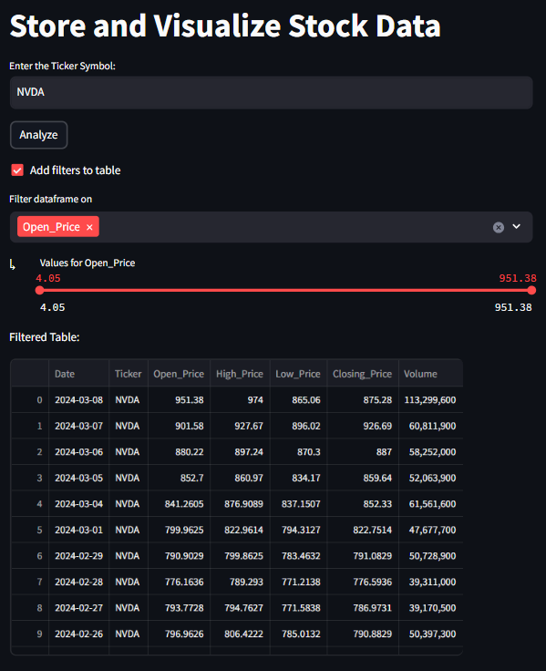

# NewsWaveMetrics 📊📰
---

 A powerful tool for analyzing news sentiment on both national and local stories, allowing users to correlate these stories with their own uploaded metrics, starting with stock market price data. Stay ahead of the curve and make informed decisions with SentimentSync.

 ## Features 🌟

 ### Stock Data Collection 📈
An automated procedure designed to fetch daily stock data for a predetermined ticker and store this data in the database for the past five years.

